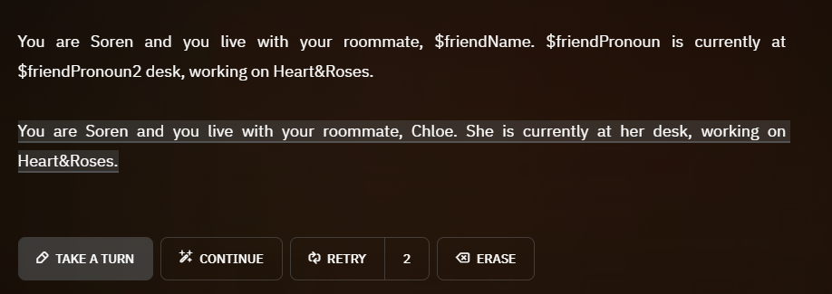
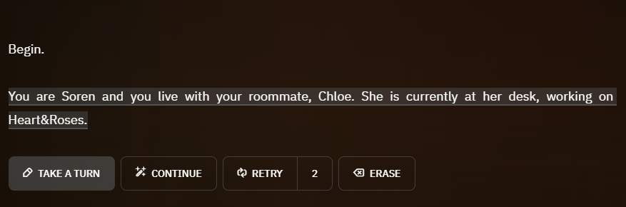

# DynamicOpener
> \> [library.js](./out/library.js)


A dynamic scenario loader that **runs once** the very start of a new adventure.

This aims to solve the use of "they", "their" in scenario openings when genders are up to the user. This ambiguity is left to the AI even if the user has stated explicitly of the character's gender, so with a little bit of ***conditionals***, hopefully, it'll lessen the maintenance for the user.

<hr>

### Makes changes on
* Plot Essentials
* Author's Note
* StoryCards
* History*

\* See [Optional implementation](#optional-implementation)
<hr>

# Implementation
In either [`input`](./out/input.js) or [`context`](./out/context.js):
```js
[...]
const data = DynamicOpener.initialize()
if (data) { // Verify data isn't null.
    console.log(data["playerName"])
    [...]
}
DynamicOpener.apply()
// subsequent libraries
[...]
```
where `data` is the parsed table of values from **Plot Essentials** *(which is discussed more on [Guide](#guide))*.

Any changes or updates made to `data`  is reflected back internally to the `state["DynamicOpener"]` object.

```js
const data = DynamicOpener.initialize()
if (data) {
    console.log(state["DynamicOpener"] === data) // true
    data["myNewVar"] = "newValue"
    console.log(state["DynamicOpener"] === data) // true
}
DynamicOpener.apply()
```
In [`output`](./out/output.js):
```js
[...]
// subsequent libraries
DynamicOpener.cleanup()
[...]
```
DynamicOpener will clear `state["DynamicOpener"]` after the user has taken more than two `do/say/story/continue` actions on their adventure. At this point, DynamicOpener will be dormant.

### Optional implementation
In [`output`](./out/output.js):
```js
[...]
text = DynamicOpener.remakeOpening()
// subsequent libraries
DynamicOpener.cleanup()
[...]
```
This will redo the scenario opening once on the start of a new adventure. It will **not overwrite** the preexisting one but if the opening has [reference variables](#referring-variables), it will refer to the variable's value. See below.


Text example if image isn't working

```
# Scenario Creator > Opening
You are ${name} and you live with your roommate, $friendName. $friendPronoun is currently at $friendPronoun2 desk, working on Heart&Roses.

# Adventure
You are Soren and you live with your roommate, $friendName. $friendPronoun is currently at $friendPronoun2 desk, working on Heart&Roses.

============ [remakeOpening() is ran] ============

You are Soren and you live with your roommate, $friendName. $friendPronoun is currently at $friendPronoun2 desk, working on Heart&Roses.

You are Soren and you live with your roommate, Chloe. She is currently at her desk, working on Heart&Roses.
```

You can override how DynamicOpener gets the scenario opening by entering a string into its arguments.
```js
text = DynamicOpener.remakeOpening(`You are $playerName and you live with your roommate, $friendName. $friendPronoun is currently at $friendPronoun2 desk, working on Heart&Roses.`)
```


Text example if image isn't working

```
# Scenario Creator > Opening
Begin.

# Adventure
Begin.

============ [remakeOpening() is ran] ============

Begin.

You are Soren and you live with your roommate, Chloe. She is currently at her desk, working on Heart&Roses.
```
Since it is done in scripting, user prompts will not work unless assigned to a [reference variable](#referring-variables).

# Guide
### Defining a variable:
Variables are defined in **Plot Essentials**. Generally, the format for defining variables is:

    {name}={value}

where `name` is a string of alphanumeric characters `a-zA-Z0-9_` and `value` can be any string of characters.

### Conditional Value Format
If you like to assign a conditional assignment:

    {condition1} {comparison operator} {condition2} ? {trueValue} : {falseValue}

`condition1` is a string of characters *(if any)*, not including `!=<>*~`

`comparison operator` is one of `!=`, `==`, `<=`, `>=`, `<`, `>`, `!<`, `!>`, `*=`, `~=`, `~*`
* `*=` Contains the word..?
* `~=` Case-insensitive equality
* `~*` Contains the word..? (case-insensitive)

`condition2` is a string of characters *(if any)*, not including `?`

`trueValue` is any string of characters *(if any)*, not including `:`

`falseValue` is any string of characters *(if any)*

`condition1`, `condition2`, `trueValue`, and `falseValue` can be a [reference variable](#referring-variables) or a user prompt.

### Referring Variables
To use your defined variables, simply prefix a `$` with its name.

    $variableName
Mind that the name must be **alphanumeric** as defined previously in [Defining a variable](#defining-a-variable).

### So all together...
This is what a full assignment looks like:

```
# Inside Plot Essentials
maleString = male
isHeOrShe = ${Are you a male or a female?} == $maleString ? he : she

${name} is a ${Are you a male or a female?} human. $isHeOrShe is known by others to be the life of the party.
```
First, `maleString` is assigned `male`.

Then `isHeOrShe` is evaluated as a conditional value. Meaning...

* `condition1` is `${Are you a male or female}` which assuming the user enters, with <u>exact casing</u>, `condition1` will be `male` or `female`

* `comparsion operator` is `==` which will use Javascript's `===` operator.

* `condition2` is `$maleString` which has the value `male`

And when evaluated, `isHeOrShe` will be `he` or `she`, respectively.

Final results:
```
# Inside Plot Essentials
Soren is a male human. He is known by others to be the life of the party.
```
Notes:

* Capitalization of `He`, *(internally, its `he`)*. DynamicOpener will automatically capitalize letters at the beginning of sentences.
* Variables are gone but not entirely. You can access them via scripting through `state["DynamicOpener"]`

# Extra Utility Functions
### DynamicOpener.Extra.genderKeys()
    DynamicOpener.Extra.genderKeys()

Modifies on `data` to provides a set of keys that relies on gender. Must provide a predefined key **containing the word, gender, with its values being 'male' or 'female'** respectively.

See [implementation](./src/library.js#L308) for a list of incorporated keys.

```javascript
data["plrGender"] = "male"
console.log(data["plrhe"]) // he
console.log(data["plrHe"]) // He (capitalized form)
console.log(data["plrhimself"]) // himself
console.log(data["plrHimself"]) // Himself (capitalized form)

data["plrGender"] = "female"
console.log(data["plrhe"]) // she
console.log(data["plrHe"]) // She (capitalized form)
console.log(data["plrhimself"]) // herself
console.log(data["plrHimself"]) // Herself (capitalized form)
```
Naturally, `DynamicOpener` will autocapitalize by default. Use the capitalized  form to enforce capitalization.
# Compiling & Updating
> Requires [Python](https://www.python.org/downloads) and [Git](https://git-scm.com) to be installed on your system.

Clone the repository and make sure your terminal's current working directory is in the **root** of the repository before ***running any scripts***.

Run:
```sh
git pull
python scripts/dependencies.py -u
python scripts/build.py
```

There should be a generated `lib` folder and `out` folder. Your compiled files are in the `out` directory.